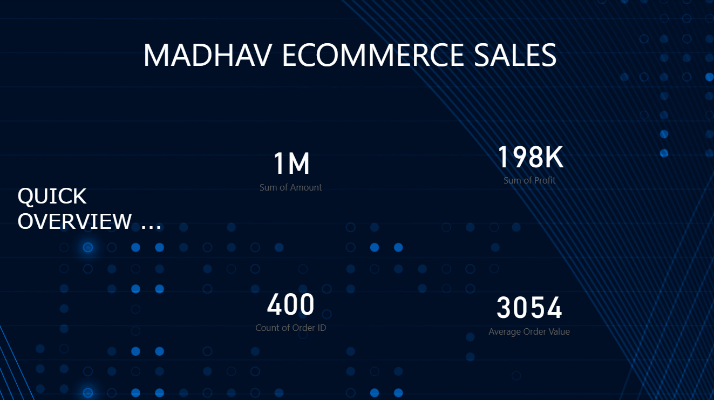
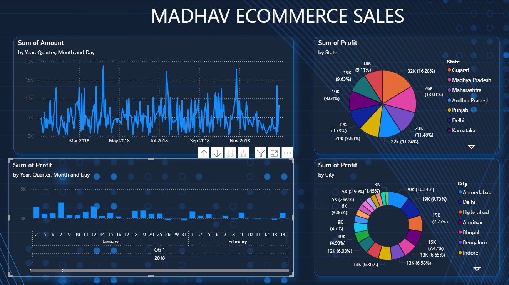

# 📊 Madhav Store Sales Dashboard (Power BI)

## Overview

The **Madhav Store Dashboard Project** is a data analysis and visualization project designed to uncover sales insights for an online retail business. Using **Power BI**, this project transforms raw sales and order data into an interactive dashboard to help decision-makers identify trends, improve performance, and make data-driven business decisions.

---

## 🎯 Objective

To analyze and visualize key performance metrics such as revenue, profit, product category trends, and regional sales, enabling better business understanding and operational efficiency for Madhav Store.

---

## 🧾 Dataset Details

The dataset consists of **400+ records** across two files:

1. **Orders Dataset** – Order ID, Customer Name, City, State, Region, Order Date, and Shipping details.
2. **Sales Dataset** – Product Category, Sub-Category, Quantity, Sales, Profit, and Discount details.

Data is entirely sample-based and generated for academic and analytical learning purposes.

---

## 🛠️ Tools & Skills Used

* **Power BI** – Dashboard design and data visualization
* **Excel** – Data cleaning and transformation
* **Power Query** – Data modeling and relationships
* **Data Analysis** – KPI calculations and performance tracking
* **Visualization Design** – Interactive charts, slicers, and KPIs

---

## 📈 Dashboard Features

* **Sales Overview** – Total Sales, Profit, Quantity, and Discount visualized via KPIs
* **Category & Sub-Category Analysis** – Performance breakdown of each product category
* **Regional Insights** – Map-based visualization of sales by region and state
* **Top Customers & Products** – Ranking visual for most profitable customers and products
* **Interactive Filters** – Dynamic filtering by category, date, and location

Each element of the dashboard is designed to give a quick and actionable business snapshot.

---

## 🔍 Key Insights

* Identified top-performing product categories and regions
* Highlighted underperforming segments for potential improvement
* Discovered correlation between discounts and profit margins
* Provided a foundation for future predictive or trend analysis

---

## 📂 Repository Structure

```
📁 Madhav-Store-Dashboard/
│
├── 📄 README.md
├── 📊 madhav_store_orders_400.csv
├── 📊 madhav_store_sales_400.csv
└── 📁 PowerBI_Dashboard/
      └── madhav_store_dashboard.pbix
```

---

## 📚 How to Use

1. Download both CSV files from this repository.
2. Open the `.pbix` file in **Power BI Desktop**.
3. Load the datasets and refresh data connections.
4. Explore the interactive dashboard and apply filters to analyze various dimensions.

---

## 🧠 Learning Outcomes

* Building and connecting relational data models
* Applying DAX formulas for KPIs
* Designing clean, business-ready dashboards
* Presenting data insights for management decision-making

---

## 👤 Author

**Mahesh Sharma**
MBA Student | Aspiring Business Analyst & Data-Driven Manager

📎 [LinkedIn](https://www.linkedin.com/in/mahesh-sharma-4ba278381)
💻 [GitHub](https://github.com/Mahesh-Sharma-51/Madhav-Store)

---

⭐ *If you find this project useful, please star the repository to show your support!*

## 📊 Dashboard Preview


